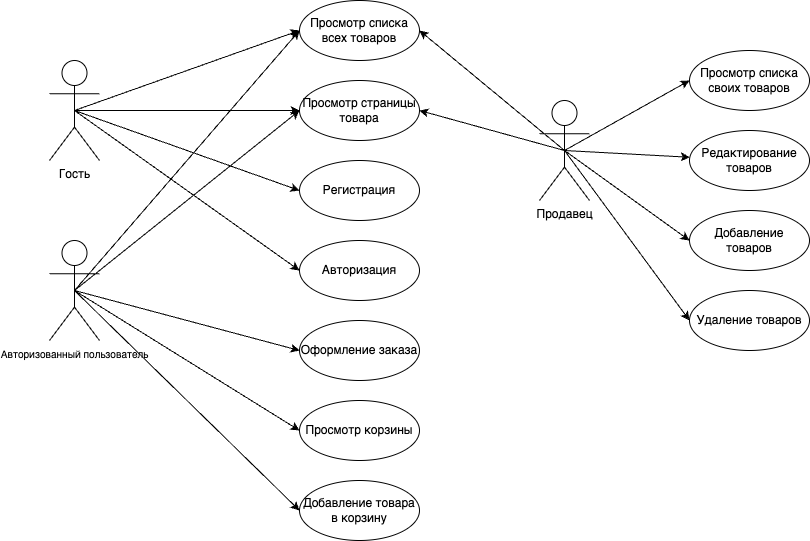
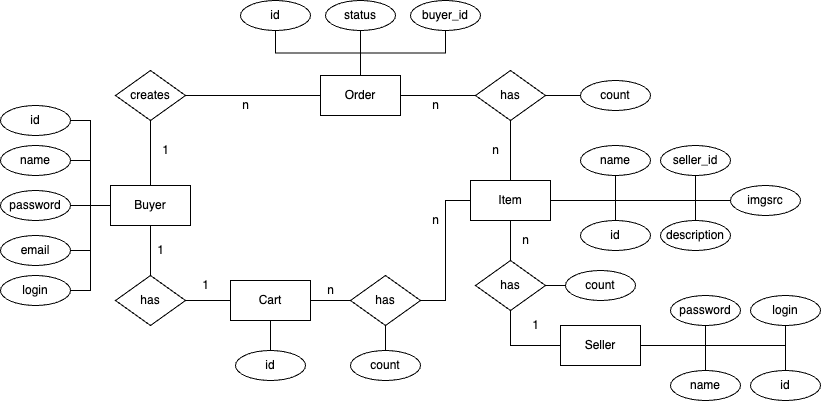
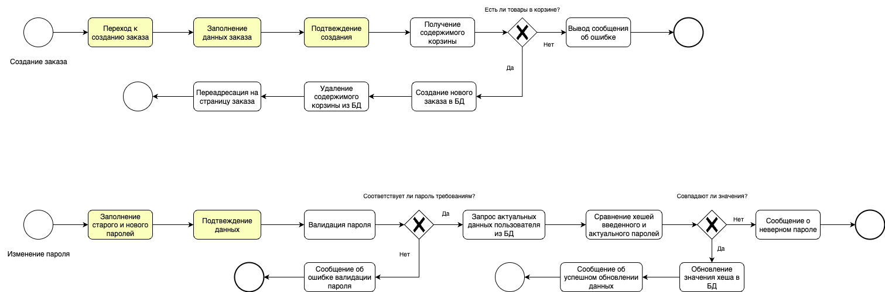
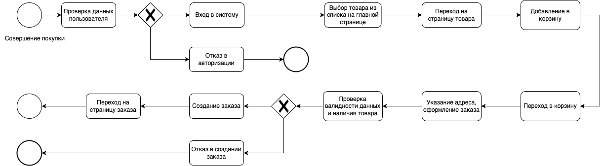
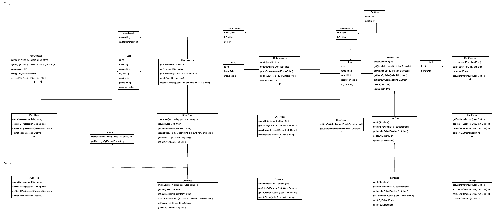
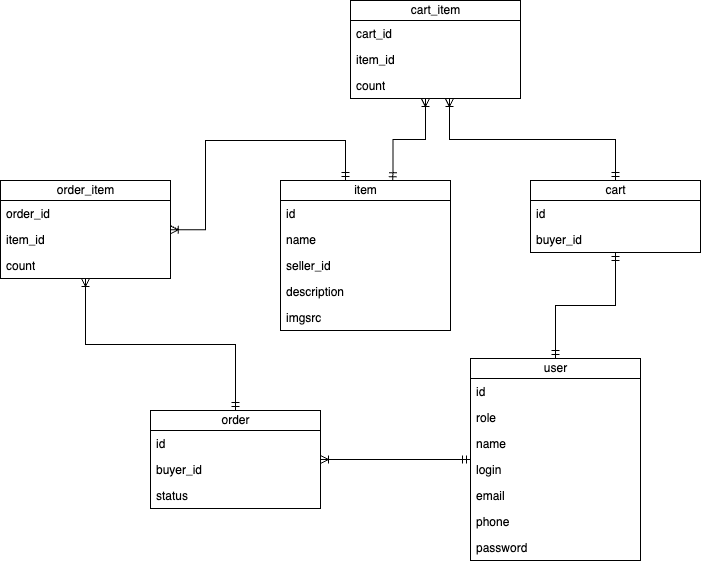
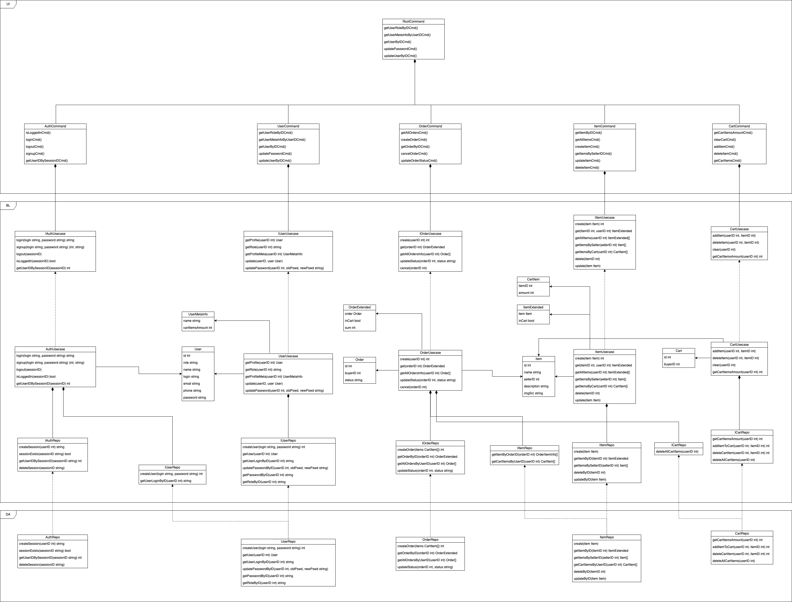

# Bizon

Bizon - это площадка, на которой покупатель может найти товары от множества продавцов.  
При выборе товара помогут отзывы, оставленные пользователями, которые уже успели совершить покупку.

## Краткое описание предметной области

Предметной областью является торговля товарами различных категорий.  
Любой продавец может зарегистрироваться на платформе и запустить продажу своего товара.  
Покупатель получает широкий выбор товаров.  

## Анализ существующих решений

Сравним существующие решения по следующим критериям:
1. Товары доступны для доставки в любую точку мира
2. Несколько категорий товаров
3. Бесплатная доставка

| | Критерий 1 | Критерий 2 | Критерий 3 |
|---|---|---|---|
| Ozon | - | + | + |
| Wildberries | - | + | + |
| Yandex Market | - | + | - |
| Bizon | + | + | - |

## Краткое обоснование целесообразности и актуальности проекта

*По данным компании «Медиаскоп», в России в 2022 году насчитывалось 98,6 миллиона интернет-пользователей — это 78% жителей старше 12 лет. В 2016 году было 76%.*

*По данным официальной статистики, около 76 миллионов россиян хотя бы раз что-то купили в интернете в 2022 году.*

Приведенные выше факты говорят о росте популярности онлайн-шоппинга.
Маркетплейс агрегирует товары от множества продавцов, развивая конкуренцию.
Благодаря этому расширяется ассортимент и улучшается общее качество товаров.

Следовательно, площадка с широким выбором товаров для покупки не выходя из дома актуальна как никогда.

## Краткое описание акторов (ролей)

Гость (неавторизованный пользователь) может просматривать список товаров, переходить на страницу выбранного товара.

Авторизованный пользователь получает возможность:  
- добавлять товары в корзину
- оформлять заказы
- видеть историю заказов
- настраивать профиль

Продавец может добавлять новые товары и удалять принадлежащие ему айтемы.

## Use-case диаграмма

## ER-диаграмма сущностей

## Пользовательские сценарии

Добавление товара в корзину
1. Пользователь заходит на главную страницу сайта
2. Он кликает на один из товаров, представленных на странице
3. Пользователь оказывается на странице товара
4. Добавляет товар в корзину

Оформление заказа
1. Пользователь переходит в корзину
2. Нажимает оформить заказ
3. Появляется уведомление об успешном создании заказа
4. Пользователь кликает на уведомление, переходит в корзину
5. Переходит на страницу заказа, видит статус и содержимое

Добавление товара продавцом
1. Продавец заходит в профиль
2. Переходит в "Мои товары"
3. Нажимает кнопку "Добавить товар"
4. Вводит данные о товаре
5. Получает уведомление об успешности добавления
6. Переходит в карточку товара

## Формализация бизнес-правил

## Описание типа приложения и выбранного технологического стека

Тип приложения - Web SPA.  
- Backend: Go  
- Frontend: TS, SCSS  
- DB: Postgres, Redis  

## Верхнеуровневое разбиение на компоненты

## UML диаграмма классов

## Диаграмма сущностей БД

## Уточненная диаграмма сущностей

