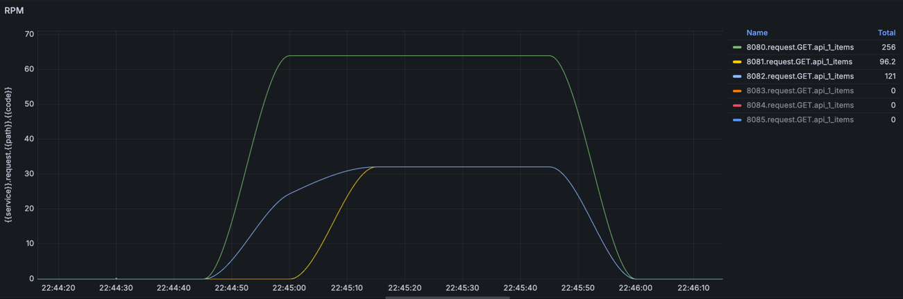
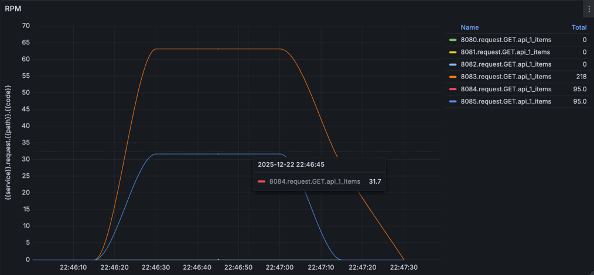
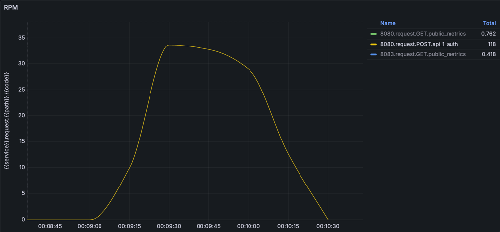
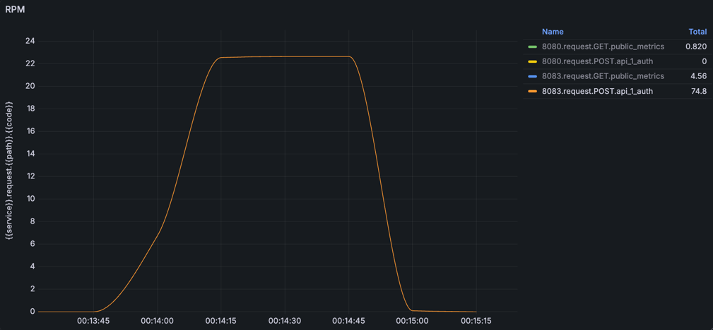

# Нагрузочное тестирование

## Условия проведения исследования
Тестирование проводилось с применением утилиты wrk.  
Например, для тестирования POST запросов (запросы идут только на пишущую реплику) использовалась команда:  
`wrk -t5 -c10 -d1m -s load_test/login_req.lua http://localhost/api/v1/auth`

## Результаты

### Основное приложение - балансировка

По графику видно, что на инстанс, находящийся на порту 8080, идет в 2 раза больше запросов по сравнению с 2 другими репликами (на портах 8081 и 8082).  



```text
Running 1m test @ http://localhost/api/v1/items
  5 threads and 10 connections
  Thread Stats   Avg      Stdev     Max   +/- Stdev
    Latency     7.36ms    4.87ms  51.82ms   84.78%
    Req/Sec   269.77     48.31   380.00     66.81%
  6406 requests in 1.00m, 9.71MB read
Requests/sec:    106.59
Transfer/sec:    165.41KB
```

### Дополнительный инстанс - балансировка



```text
Running 1m test @ http://localhost/mirror/api/v1/items
  5 threads and 10 connections
  Thread Stats   Avg      Stdev     Max   +/- Stdev
    Latency     7.70ms    6.02ms  68.55ms   87.87%
    Req/Sec   253.55     64.04   360.00     74.80%
  6322 requests in 1.00m, 9.58MB read
Requests/sec:    105.18
Transfer/sec:    163.22KB
```

### Основное приложение - запросы на запись



```text
Running 1m test @ http://localhost/api/v1/auth
  5 threads and 10 connections
  Thread Stats   Avg      Stdev     Max   +/- Stdev
    Latency   122.34ms   30.45ms 275.26ms   75.09%
    Req/Sec    16.14      5.31    30.00     63.16%
  1991 requests in 1.00m, 709.68KB read
Requests/sec:     33.13
Transfer/sec:     11.81KB
```

### Дополнительный инстанс - запросы на запись



```text
Running 1m test @ http://localhost/mirror/api/v1/auth
  5 threads and 10 connections
  Thread Stats   Avg      Stdev     Max   +/- Stdev
    Latency   121.70ms   30.46ms 288.77ms   78.64%
    Req/Sec    15.98      5.12    30.00     63.71%
  1833 requests in 1.00m, 670.85KB read
Requests/sec:     31.86
Transfer/sec:      10.72KB
```
